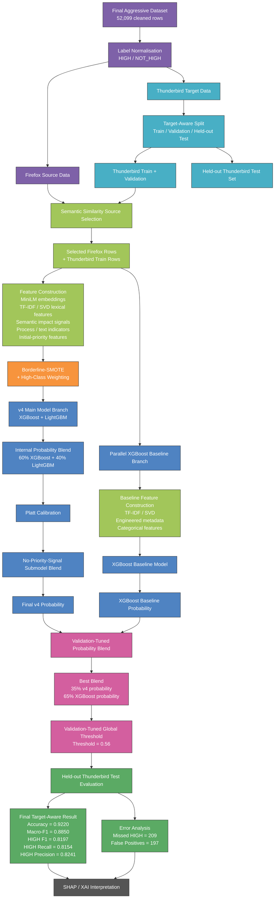

# Target-aware v4 + XGBoost Pipeline

```mermaid
flowchart TD

    A["Final Aggressive Dataset<br/>52,099 cleaned rows"] --> B["Label Normalisation<br/>HIGH / NOT_HIGH"]

    B --> C1["Firefox Source Data"]
    B --> C2["Thunderbird Target Data"]

    C2 --> D1["Target-Aware Split<br/>Train / Validation / Held-out Test"]
    D1 --> D2["Thunderbird Train + Validation"]
    D1 --> D3["Held-out Thunderbird Test Set"]

    C1 --> E["Semantic Similarity Source Selection"]
    D2 --> E

    E --> F["Selected Firefox Rows<br/>+ Thunderbird Train Rows"]

    F --> G["Feature Construction<br/>MiniLM embeddings<br/>TF-IDF / SVD lexical features<br/>Semantic impact signals<br/>Process / text indicators<br/>Initial-priority features"]

    G --> H["Borderline-SMOTE<br/>+ High-Class Weighting"]

    H --> I1["v4 Main Model Branch<br/>XGBoost + LightGBM"]
    I1 --> I2["Internal Probability Blend<br/>60% XGBoost + 40% LightGBM"]
    I2 --> I3["Platt Calibration"]
    I3 --> I4["No-Priority-Signal Submodel Blend"]
    I4 --> I5["Final v4 Probability"]

    F --> J1["Parallel XGBoost Baseline Branch"]
    J1 --> J2["Baseline Feature Construction<br/>TF-IDF / SVD<br/>Engineered metadata<br/>Categorical features"]
    J2 --> J3["XGBoost Baseline Model"]
    J3 --> J4["XGBoost Baseline Probability"]

    I5 --> K["Validation-Tuned Probability Blend"]
    J4 --> K

    K --> L["Best Blend<br/>35% v4 probability<br/>65% XGBoost probability"]
    L --> M["Validation-Tuned Global Threshold<br/>Threshold = 0.56"]

    M --> N["Held-out Thunderbird Test Evaluation"]

    N --> O["Final Target-Aware Result<br/>Accuracy = 0.9220<br/>Macro-F1 = 0.8850<br/>HIGH F1 = 0.8197<br/>HIGH Recall = 0.8154<br/>HIGH Precision = 0.8241"]

    N --> P["Error Analysis<br/>Missed HIGH = 209<br/>False Positives = 197"]

    O --> Q["SHAP / XAI Interpretation"]
    P --> Q

    classDef data fill:#7E61A8,color:#fff,stroke:#333,stroke-width:1px;
    classDef target fill:#48AFC5,color:#fff,stroke:#333,stroke-width:1px;
    classDef feature fill:#A2C65A,color:#fff,stroke:#333,stroke-width:1px;
    classDef train fill:#F7943D,color:#fff,stroke:#333,stroke-width:1px;
    classDef model fill:#4F83C2,color:#fff,stroke:#333,stroke-width:1px;
    classDef blend fill:#D35F9F,color:#fff,stroke:#333,stroke-width:1px;
    classDef result fill:#5BAA64,color:#fff,stroke:#333,stroke-width:1px;
    classDef xai fill:#555555,color:#fff,stroke:#333,stroke-width:1px;

    class A,B,C1 data;
    class C2,D1,D2,D3 target;
    class E,F,G,J2 feature;
    class H train;
    class I1,I2,I3,I4,I5,J1,J3,J4 model;
    class K,L,M blend;
    class N,O,P result;
    class Q xai;
```
